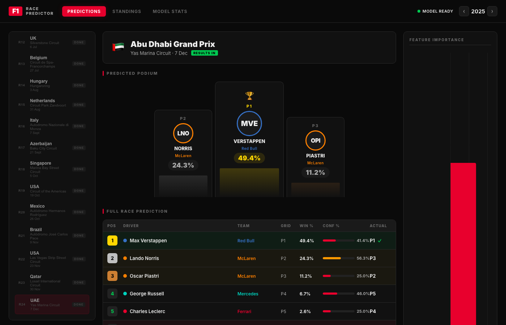
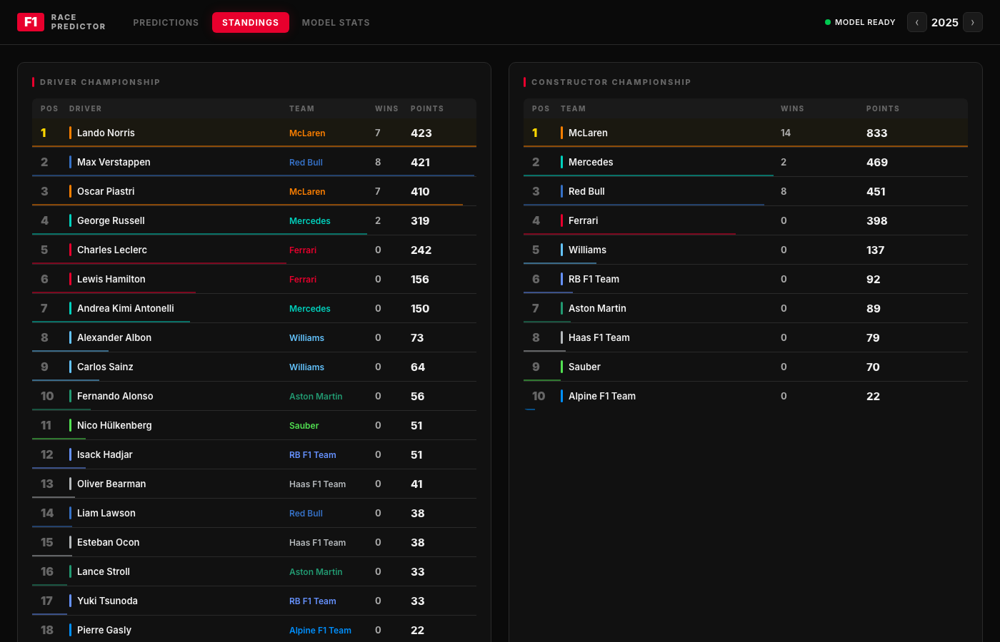
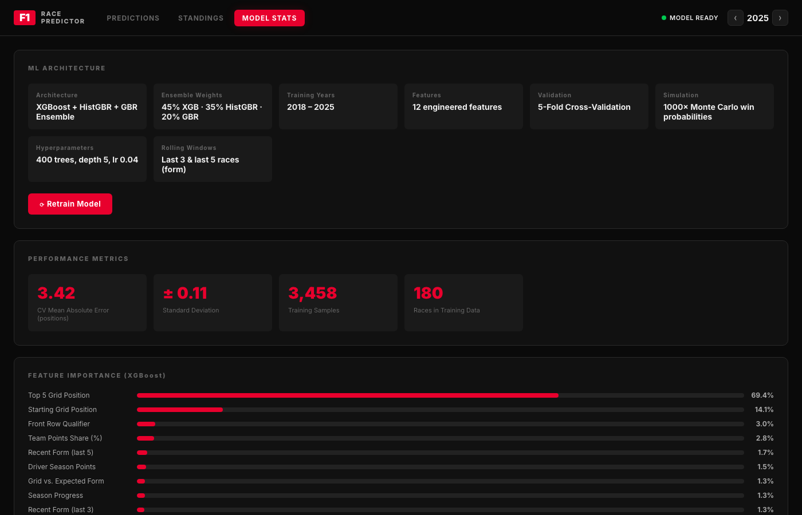

# 🏎️ F1 Race Predictor

A machine learning web app that predicts Formula 1 race finishing positions using real historical data. Built with a **XGBoost + HistGBR + Gradient Boosting ensemble** trained on 8 seasons of F1 data (2018–2025).

🚀 **Live demo: [f1-race-predictor-production-0a10.up.railway.app](https://f1-race-predictor-production-0a10.up.railway.app)**



---

## Features

- **Race Predictions** — predicted finishing order for any race with win probabilities and confidence scores
- **Podium Visualization** — P1/P2/P3 cards with win percentage for each driver
- **Full Grid Table** — all 20 drivers ranked by predicted position with confidence bars
- **Driver & Constructor Standings** — live championship data with team colors
- **Model Stats** — feature importance chart, CV accuracy metrics, retrain button
- **Real F1 Data** — fetches from the Jolpica/Ergast F1 API, cached locally

---

## Screenshots

### Predictions


### Standings


### Model Stats & Feature Importance


---

## How It Works

### Data
Fetches race results, qualifying data, and standings from the free [Jolpica F1 API](https://api.jolpi.ca/) (2018–2025, ~3,500 driver-race records). All responses are cached locally so data is only downloaded once.

### Feature Engineering
12 features are engineered per driver per race:

| Feature | Description |
|---------|-------------|
| Grid Position | Starting position on the grid |
| Top 5 Grid Flag | Binary: started in top 5 (strongest signal) |
| Front Row Flag | Binary: P1 or P2 start |
| Recent Form (last 3) | Average finish in last 3 races |
| Recent Form (last 5) | Average finish in last 5 races |
| Finishing Consistency | Std deviation of last 5 finishes |
| Circuit History Avg | Driver's historical avg finish at this circuit |
| Circuit Experience | Number of times driver has raced here |
| Team Points Share | Constructor's % of total championship points |
| Driver Season Points | Points accumulated before this race |
| Season Progress | Race number / total races |
| Grid vs. Expected Form | Grid position minus recent avg (over/underperformance) |

### Model

Three models are trained and blended into an ensemble:

```
Prediction = 0.45 × XGBoost + 0.35 × HistGradientBoosting + 0.20 × GradientBoosting
```

- **400 estimators**, max depth 5, learning rate 0.04
- **5-fold cross-validation** (time-aware — no future data leakage)
- **1,000× Monte Carlo simulation** to generate calibrated win probabilities

### Accuracy

| Metric | Value |
|--------|-------|
| CV Mean Absolute Error | **3.41 positions** |
| Std Deviation | ± 0.11 |
| Training Samples | 3,458 |
| Seasons | 2018–2025 (180 races) |
| Naive baseline (grid = finish) | ~4.5 positions |

The model beats the naive "grid position = final position" baseline by ~1 full position.

---

## Tech Stack

| Layer | Technology |
|-------|-----------|
| Backend | Python, FastAPI, Uvicorn |
| ML | XGBoost, scikit-learn (HistGBR, GBR) |
| Data | Jolpica/Ergast F1 API, pandas, numpy |
| Frontend | Vue.js 3, Chart.js, vanilla CSS |
| Persistence | joblib (model), JSON (API cache) |
| Hosting | Railway |

---

## Getting Started

### Prerequisites
- Python 3.10+
- macOS: `brew install libomp` (required by XGBoost)

### Install & Run

```bash
git clone https://github.com/GhanshyamPaunikar/f1-race-predictor.git
cd f1-race-predictor
./setup.sh    # creates venv and installs dependencies
./run.sh      # starts server at http://localhost:8001
```

Open **http://localhost:8001** in your browser.

### First Run
On first startup the app will:
1. Download 8 seasons of F1 data (~60 seconds)
2. Train the ML ensemble (~30 seconds)
3. Save the model to `models/f1_predictor.pkl`

A progress banner shows in the UI. Every subsequent restart loads the saved model instantly.

### Retrain from Scratch

```bash
rm -rf models/ data/cache/
./run.sh
```

---

## Project Structure

```
f1-race-predictor/
├── backend/
│   ├── main.py           # FastAPI server & API routes
│   ├── predictor.py      # ML ensemble (train / predict / Monte Carlo)
│   ├── data_fetcher.py   # Jolpica API client with local caching
│   └── requirements.txt
├── frontend/
│   ├── index.html        # Vue.js 3 SPA
│   ├── style.css         # F1-themed dark UI
│   └── app.js            # Reactive frontend
├── screenshots/          # UI screenshots
├── data/cache/           # Cached API responses (auto-created)
├── models/               # Saved ML model (auto-created)
├── setup.sh
└── run.sh
```

---

## API Endpoints

| Endpoint | Description |
|----------|-------------|
| `GET /api/schedule/{year}` | Race calendar for a season |
| `GET /api/predict/{year}/{round}` | ML prediction for a race |
| `GET /api/standings/drivers/{year}` | Driver championship standings |
| `GET /api/standings/constructors/{year}` | Constructor standings |
| `GET /api/model/accuracy` | Model performance metrics |
| `POST /api/train` | Trigger background retraining |

---

## License

MIT
